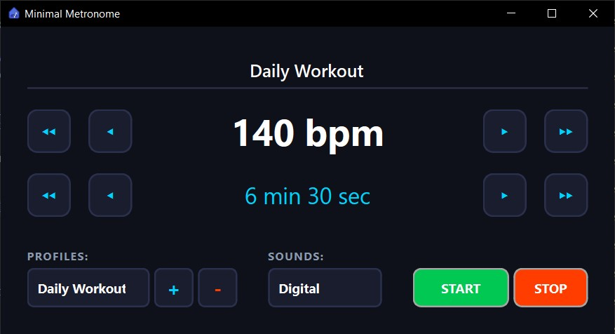

<h1>
  
  Minimal Metronome
</h1>


A clean, lightweight desktop metronome built with Python and PySide6. Designed for convenient practice.

## Screenshot



## Installation & Running

### Option 1: Download Release (Recommended)
Download the latest pre-compiled `.zip` from the [Releases](https://github.com/kacperg662/minimal-metronome/releases) page and run it directly on Windows.

### Option 2: Run from Source

**Requirements:** Python 3.10+

1. Clone the repository:
   ```bash
   git clone [https://github.com/kacperg662/minimal-metronome.git](https://github.com/kacperg662/minimal-metronome.git)
   cd minimal-metronome

## Author
Kacper Górak